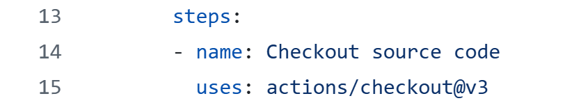
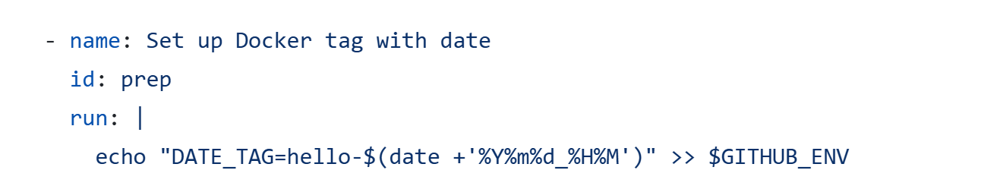
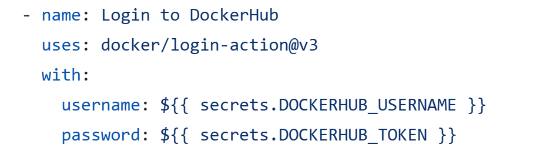
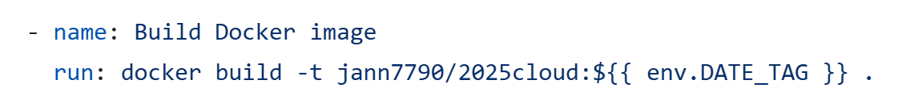
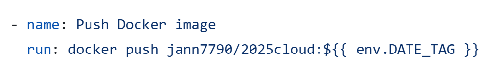

# 2025cloud Docker Sample

This is a sample project for the 2025cloud assignment.

## Build the Docker image

```bash
docker build -t jann7790/2025cloud:hello .
```

## Run the container

```bash
docker run --rm jann7790/2025cloud:hello
```

## Output

```
Hello from main.py inside a Docker container!
```

## CI/CD

本專案使用 GitHub Actions 實現自動化 CI/CD 流程：

1. 當程式碼推送到 `main` 分支時，自動觸發建置流程
2. 建構 Docker 映像檔
3. 使用動態時間標籤格式 `hello-yyyymmdd_hhMM`（例如：`hello-20250503_1545`）
4. 自動推送至 Docker Hub

jann7790: 描述目前專案自動化產生 Container Image
的邏輯，以及 Tag 的選擇邏輯

GitHub Copilot: I'll analyze the current project to understand how it generates container images and how it manages image tags. Let me first check the project files to gather the necessary information.Based on the analysis of your project files, let me explain how your project automates container image generation and manages image tags:

## container image 自動化產生邏輯

透過 docker-iamge.yml 使用 GitHub Actions 來自動化建置和推送 Docker 映像：

1. **觸發條件**：當程式碼被推送到 `main` 分支或有針對 `main` 分支的 Pull Request 時，CI/CD 流程會自動啟動。

2. **流程**：
   1. checkout source code
   
   2. 設置 Docker tag（使用日期時間）
   
   3. 登入 DockerHub（使用儲存的認證）
   
   4. Build Docker image
   
   5. 推送映像至 DockerHub
   


3. **Dockerfile 結構**：
   - 基於 `python:3.10-slim` iamge
   - 創建 `/app` 工作目錄
   - 複製 main.py 進入 container
   - 設置預設執行命令 `python main.py`

## Tag 選擇邏輯

您的專案採用時間戳記標籤策略：

1. **標籤格式**：`hello-yyyymmdd_HHMM`
   - 例如：`hello-20250503_1545

2. **生成方式**：
   ```
   echo "DATE_TAG=hello-$(date +'%Y%m%d_%H%M')" >> $GITHUB_ENV
   ```
